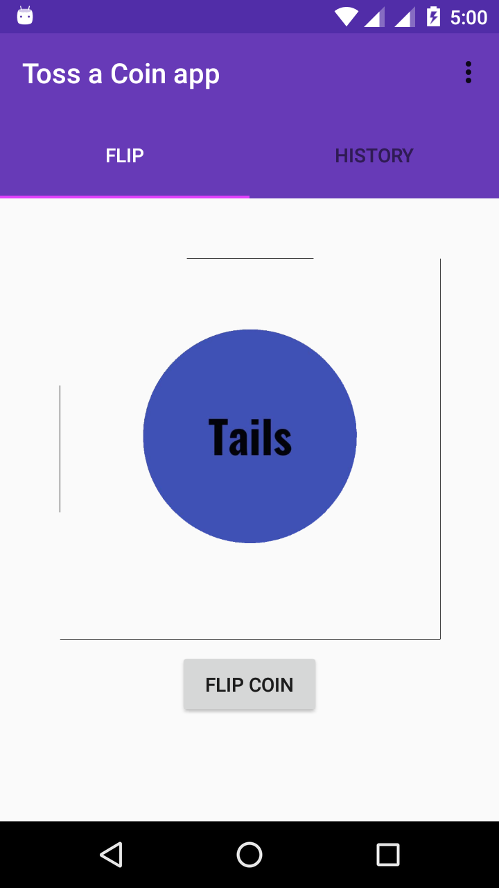
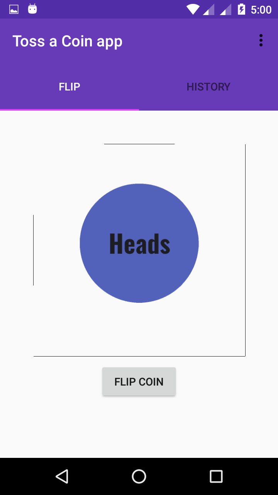
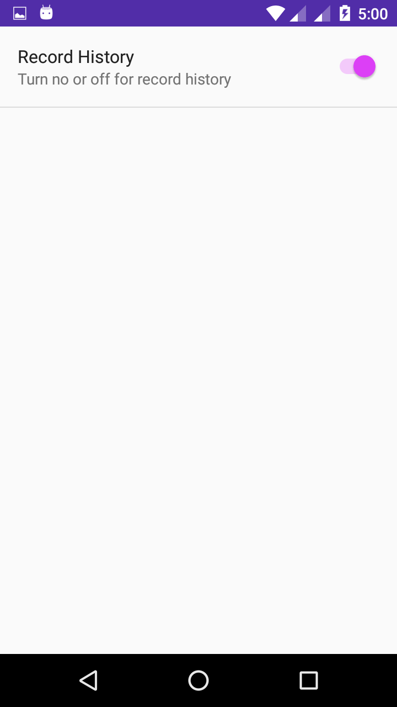
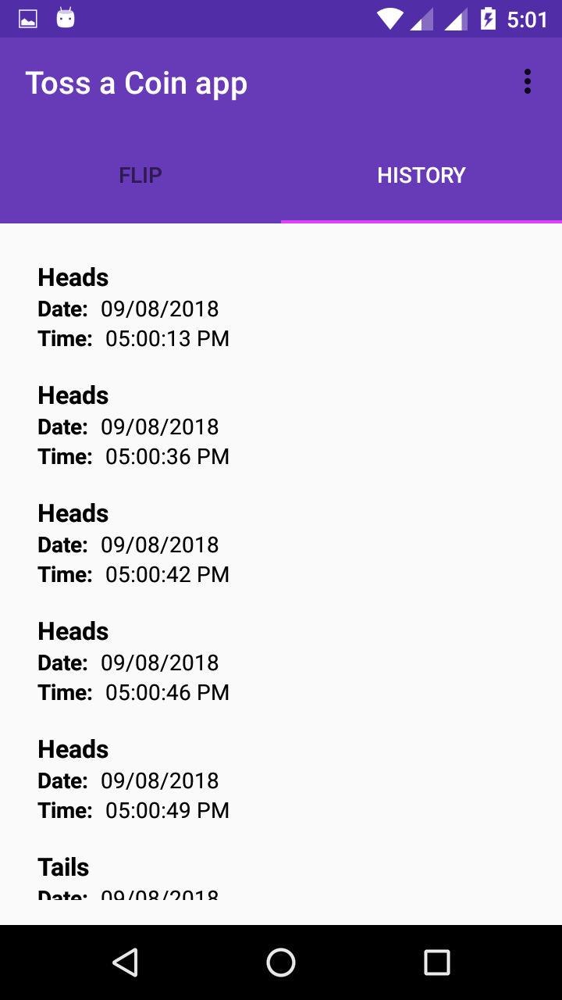

# Toss A Coin App (Android architecture components).

This is Flip a coin app and Records the Flip History.

This Example Show's:-

1) How to use fragments with ViewModel.
2) How to make Simple app with Setting in Andorid.
3) How to use Thread Pool to save in data in background.

- Database Operations use:-

 1) Insert.
 2) Delete.

- Android architecture components:-

 1) LiveData.
 2) ViewModel.
 3) Room Persistence Library. 

### Note:-

Here we are using **LiveData instead of Loader**. We can use **LiveData instead of Loader**.
You can Check this documentation for Loader and LiveData [Click here](https://developer.android.com/guide/components/loaders).

### Question:-

1) Can we use **LiveData instead of Loader**? 
**Ans**:- Yes we can use **LiveData instead of Loader**. 

## Screenshots:-

  

 

